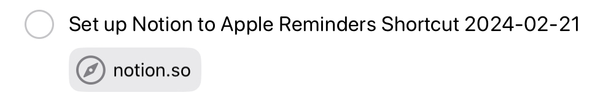

# How to Set Up An Apple Shortcut That Sends Notion Pages to Apple Reminders 

## Introduction

This article will show you how to build an Apple Shortcuts automation that exports Notion data (namely tasks) to Apple Reminders. For those who are unfamiliar with these applications, Apple Shortcuts is a task automation platform, Notion is a customizable productivity platform, and Apple Reminders is a task management platform. This article and the provided shortcut will enable you to automatically transfer the following Notion page data to Apple reminders:

- The page title
- The due date associated with the page (if specified)
- A link back to the page in Notion

For example, you have this Notion task page:

...and it becomes this task in Apple Reminders:

Several terms and conventions are used throughout this article to help explain the components of the applications and how to work with them. These are as follows:

- Apple Shortcuts (capitalized)
  : Refers to the application
- "shortcut" (not capitalized)
  : Refers to an automation that is built with the application. 
- "Actions," "variables," and "documents"
  : Building blocks of a shortcut.
- "Pages"
  : The building blocks of Notion, which contain the data that will be transferred.
- "Application programming interface" (API)
  : Technology that enables the transfer of data between two applications.
- API "secret"
  : A code that verifies that the transfer of data between the applications is authorized. 
- "JSON"
  : A simple coding language that we will use to specify which information we want the API to transfer.
- "Dot notation"
  : A syntax that is used to navigate JSON libraries.

## Requirements

You will need a MacOS or iOS-based Apple device in order to build this shortcut. Coding is not necessary to achieve the shortcut functionality mentioned in the introduction. To further potentiate or customize the shortcut, however, you will need an understanding of JSON, dot notation and interpreting API documentation. Setting up the basic shortcut will take about 30 minutes, but it will save you much more time once implemented--so let's get started! 

# Step One: Retrieve Your Notion Database ID

You need to select a Notion database that contains the pages you want exported to Apple Reminders. You will then find the ID for this database and enter it into your shortcut. Linked below are third-party instructions that explain how to get the database ID. 

### Instructions

1. [How to Get Your Notion Database ID Quick Guide](https://notiondemy.com/notion-database-id/) 
2. Save this database ID in a safe place--you will need it in step three.

# Step Two: Set Up A New Checkbox Property in Your Selected Notion Database 

For the shortcut to work, you need to set up a checkbox property in your Notion database that marks a page that Apple Shortcuts has sent to Apple Reminders. This will ensure that Notion pages are not repeatedly transferred to Apple Reminders. Notion has already produced high-quality instructions for this task, and they are linked below. 

### Instructions

1. Review [how to manage properties in Notion](https://www.notion.so/help/database-properties#managing-properties). 
2. Create a new checkbox property in the database.
    - It is okay to hide this property in Notion if you do not wish to see it in your Notion interface. 
3. Name your new property "Processed", "Exported", or another term according to your preference.  
4. Save the property name (exactly as you entered it in Notion) in a safe place--you will need it step three.

## Step Three: Set up your Notion integration

You will need to set up a new Notion integration that will grant access to Notion's API and your API secret. You will then grant the integration permission to access the database you selected in step one. Again, Notion has already produced high-quality instructions for these tasks, and they are linked below.

### Instructions

1. [Create Your Integration in Notion](https://developers.notion.com/docs/create-a-notion-integration#create-your-integration-in-notion)
    - You have the option to upload a thumbnail photo that further identifies this integration.
2. [Get Your API Secret](https://developers.notion.com/docs/create-a-notion-integration#get-your-api-secret)
    - You will input this API secret into Apple Shortcuts in the next step.
3. [Give Your Integration Page Permissions](https://developers.notion.com/docs/create-a-notion-integration#give-your-integration-page-permissions)
    - Select the page that contains the tasks you intend to export to Apple reminders.

## Step Four: Get the Shortcut and Answer the Import Questions

You will import the shortcut to your Shortcuts application and configure it using the information that you gathered in the previous steps. 

### Instructions

1. Find the shortcut [here](https://www.icloud.com/shortcuts/f19be2c14e18423ca5176fb1005fd285) and select "Add Shortcut". A new screen will appear with questions that will faciliate configuration of the shortcut. 
2.  In the first question, input the database ID that you retrieved in step one. 
3.  In the second question, input the API secret for your Notion integration that you retrieved in step three.  
4.  In the third question, input the name of the property that you established in Notion in step two. 
5.  In the fourth question, select the Apple Reminders list you wish to have the Notion pages imported to. Then select the blue button that says "+ Add Shortcut" 

## Step Five: Run Your New Shortcut

Now that you have imported your shortcut into Apple Shortcuts, you can run it for the first time. 

### Instructions

1. Navigate to your gallery in the Shorcuts application.

2. Click on the shortcut titled "Send Notion Pages to Apple Reminders". A Privacy notification will appear at the top of the screen that says "Allow 'Send Notion Pages to Apple Reminders' to connect to 'api.notion.com'?" Select "Allow". 

3. The shortcut will process, and then a checkmark will appear in the shortcut if it processed successfully.

Additionally, you can use the following three options to run your shortcut in the future: 

- Set the shortcut to run automatically at a specified time each day.
- Add the shortcut to your home screen on iOS and select it from there.
- Prompt Siri with the title of the Shortcut.

## Step Six: Verify Your Shortcut Is Functional

When you run the shortcut using one of the methods in step five, check the following to ensure it was successful:

1. Look for a Check icon (&#9989;) or a Siri confirmation that verifies the shortcut was run successfully.
3. In Notion, look at a page you expected to export by running the shortcut. The checkbox you set up in step two should be checked off if the operation was successful.
    - There might be a delay between running the shortcut and seeing an update to the Notion property, so be patient with this. 
4. In Apple Reminders, check the list you selected in step three to verify that all the anticipated Notion pages appear as reminders. 

If some of these conditions are unsuccessful, repeat step three and verify that you are entering the information exactly as you gathered it in steps one and two.

If all of these of these conditions are successful, however, then enjoy your new integration! Hopefully it adds value to your productivity workflow. 
